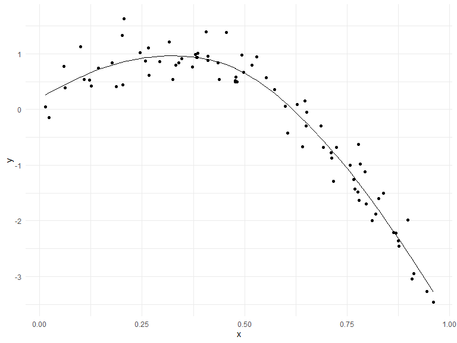
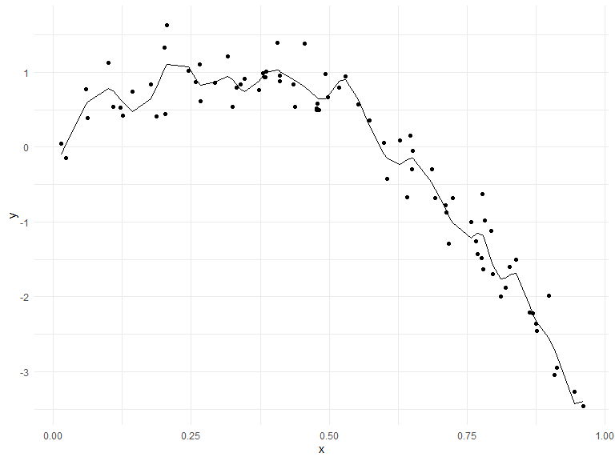
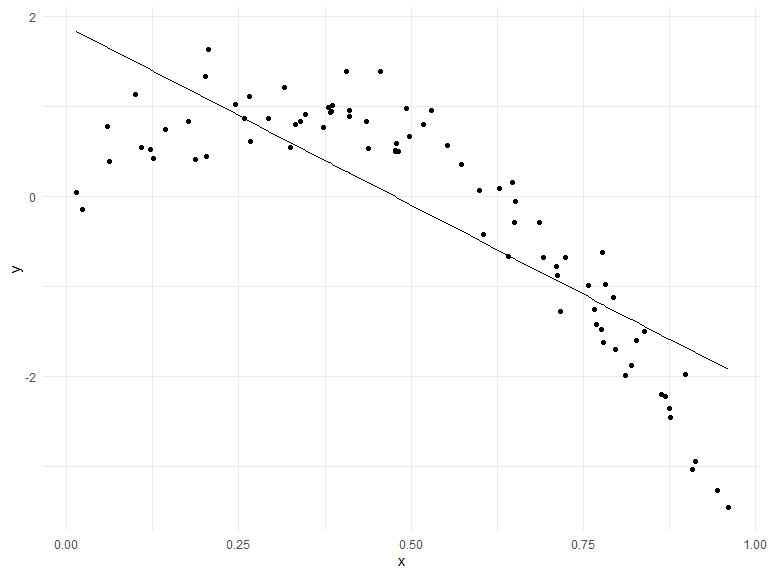
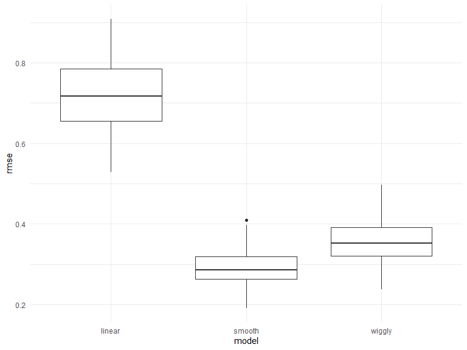
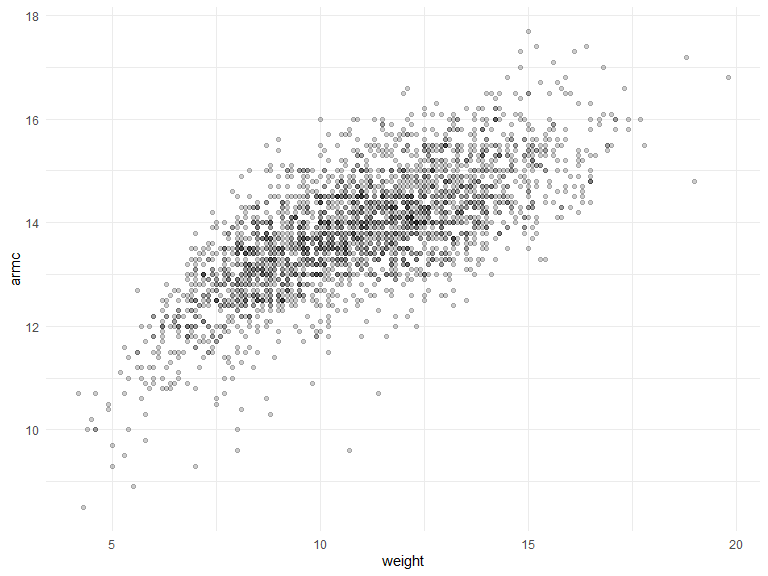
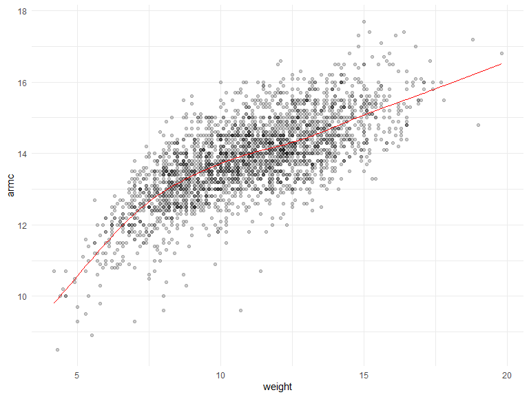
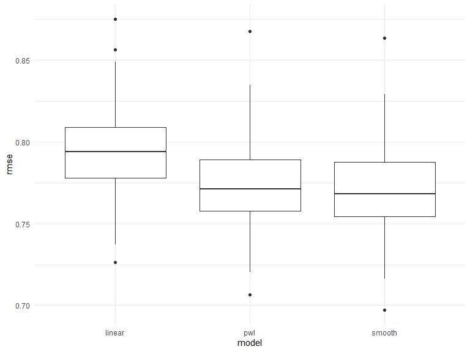

Cross validation
================

## Simulate a dataset

``` r
set.seed(1)

nonlin_df = #non linear data frame
  tibble(
    id = 1:100,
    x = runif(100, 0, 1),
    y = 1 - 10 * (x - .3) ^ 2 + rnorm(100, 0, .3)
  )


nonlin_df %>% 
  ggplot(aes(x = x, y = y)) + 
  geom_point()#from the plot we can learn that it is not a straight line
```


Create splits by hand; plot; fit some models.

``` r
train_df = sample_n(nonlin_df, 80)#choose 80 person in nonlin_df randomly
test_df = anti_join(nonlin_df, train_df, by = "id")#fthose who are in the nonlin_df but not in the train_df

ggplot(train_df, aes(x = x, y = y)) + 
  geom_point() + #black is in the train_df
  geom_point(data = test_df, color = "red")#red is in the test_df
```


Fit my models:

``` r
linear_mod = lm(y ~ x, data = train_df)#get an linear model(it's also a function)
smooth_mod = mgcv::gam(y ~ s(x), data = train_df)#s(x) = y is a smooth function of x
wiggly_mod = mgcv::gam(y ~ s(x, k = 30), sp = 10e-6, data = train_df)#???
```

plot the results

``` r
train_df %>% 
  add_predictions(smooth_mod) %>% 
  ggplot(aes(x = x, y = y)) +
  geom_point() +
  geom_line(aes(y = pred))
```



``` r
train_df %>% 
  add_predictions(wiggly_mod) %>% #more complex than smooth_mod, but it's too complex
  ggplot(aes(x = x, y = y)) +
  geom_point() +
  geom_line(aes(y = pred))
```



``` r
train_df %>% 
  add_predictions(linear_mod) %>% #not complex at all
  ggplot(aes(x = x, y = y)) +
  geom_point() +
  geom_line(aes(y = pred))
```



quantify the results

``` r
rmse(linear_mod, test_df)# rude mean square error
```

    ## [1] 0.7052956

``` r
rmse(smooth_mod, test_df)# min rmse
```

    ## [1] 0.2221774

``` r
rmse(wiggly_mod, test_df)
```

    ## [1] 0.289051

## CV iteratively

Use `modelr::crossv_mc`.

``` r
cv_df = 
  crossv_mc(nonlin_df, 100, test = .2) %>% #put 0.2 of the df in the test data frame===79 train and 21 test
  mutate(
    train = map(train, as_tibble),
    test = map(test, as_tibble)
  )

cv_df %>% pull(train) %>% .[[1]]#pull out the 1st data set
```

    ## # A tibble: 79 x 3
    ##       id      x       y
    ##    <int>  <dbl>   <dbl>
    ##  1     1 0.266   1.11  
    ##  2     2 0.372   0.764 
    ##  3     3 0.573   0.358 
    ##  4     4 0.908  -3.04  
    ##  5     6 0.898  -1.99  
    ##  6     7 0.945  -3.27  
    ##  7     8 0.661  -0.615 
    ##  8     9 0.629   0.0878
    ##  9    10 0.0618  0.392 
    ## 10    11 0.206   1.63  
    ## # ... with 69 more rows

Let’s fit some models …

``` r
cv_df =
  cv_df %>% 
  mutate(
    linear_mod = map(.x = train, ~lm(y ~ x, data = .x)),
    smooth_mod = map(.x = train, ~gam(y ~ s(x), data = .x)), 
    wiggly_mod = map(.x = train, ~gam(y ~ s(x, k = 30), sp = 10e-6, data = .x))
  ) %>% 
  mutate(
    rmse_linear = map2_dbl(.x = linear_mod, .y = test, ~rmse(model = .x, data = .y)),
    rmse_smooth = map2_dbl(.x = smooth_mod, .y = test, ~rmse(model = .x, data = .y)),
    rmse_wiggly = map2_dbl(.x = wiggly_mod, .y = test, ~rmse(model = .x, data = .y))
  )
```

Look at output

``` r
cv_df %>% 
  select(.id, starts_with("rmse")) %>% 
  pivot_longer(
    rmse_linear:rmse_wiggly,
    names_to = "model", 
    values_to = "rmse",
    names_prefix = "rmse_"
  ) %>% 
  ggplot(aes(x = model, y = rmse)) + 
  geom_boxplot()
```



## Child growth data

import data

``` r
child_growth_df = 
  read_csv("./data/nepalese_children.csv") %>% 
  mutate(
    weight_cp = (weight > 7) * (weight - 7)
  )
```

    ## Rows: 2705 Columns: 5

    ## -- Column specification --------------------------------------------------------
    ## Delimiter: ","
    ## dbl (5): age, sex, weight, height, armc

    ## 
    ## i Use `spec()` to retrieve the full column specification for this data.
    ## i Specify the column types or set `show_col_types = FALSE` to quiet this message.

``` r
child_growth_df %>% 
  ggplot(aes(x = weight, y = armc)) +
  geom_point(alpha = .2)#should we fit in linear or unlinear model
```



Consider candidate models.

``` r
linear_mod = lm(armc ~ weight, data = child_growth_df)
pwl_mod    = lm(armc ~ weight + weight_cp, data = child_growth_df)
smooth_mod = gam(armc ~ s(weight), data = child_growth_df)
```

``` r
child_growth_df %>% 
  add_predictions(smooth_mod) %>% 
  ggplot(aes(x = weight, y = armc)) + 
  geom_point(alpha = .2) + 
  geom_line(aes(y = pred), color = "red")
```



Use CV to compare models.

``` r
cv_df = 
  crossv_mc(child_growth_df, 100) %>% 
  mutate(
    train = map(train, as_tibble),
    test = map(test, as_tibble)
  )
```

Fit models and extract RMSE

``` r
cv_df =
  cv_df %>% 
  mutate(
    linear_mod = map(.x = train, ~lm(armc ~ weight, data = .x)),
    pwl_mod    = map(.x = train, ~lm(armc ~ weight + weight_cp, data = .x)),
    smooth_mod = map(.x = train, ~gam(armc ~ s(weight), data = .x)), 
  ) %>% 
  mutate(
    rmse_linear = map2_dbl(.x = linear_mod, .y = test, ~rmse(model = .x, data = .y)),
    rmse_pwl    = map2_dbl(.x = pwl_mod,    .y = test, ~rmse(model = .x, data = .y)),
    rmse_smooth = map2_dbl(.x = smooth_mod, .y = test, ~rmse(model = .x, data = .y)),
  )
```

Look at RMSE distributions.

``` r
cv_df %>% 
  select(.id, starts_with("rmse")) %>% 
  pivot_longer(
    rmse_linear:rmse_smooth,
    names_to = "model", 
    values_to = "rmse",
    names_prefix = "rmse_"
  ) %>% 
  ggplot(aes(x = model, y = rmse)) + 
  geom_boxplot()#when choosing which model we should use, choose the rmse smaller one, or see whether there are other variables that should be considered
```


